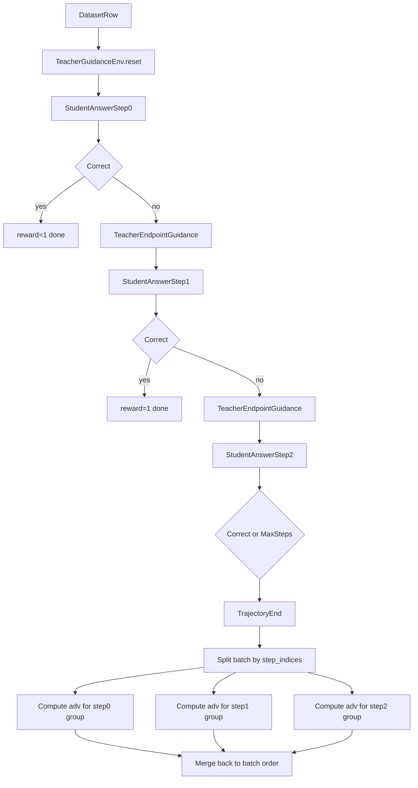

# Teacher Guidance Design in Agent-R1

## Overview

This document describes the current teacher-guidance design implemented on top of `Agent-R1`.

The target setting is:

- A student model answers a question for the first time.
- If the answer is wrong, a teacher model provides guidance.
- The student answers again conditioned on the guidance.
- This can repeat for multiple rounds, bounded by `max_steps`.

The key modeling choice is:

- Each student answer round is treated as an independent response for advantage computation.
- Different rounds are grouped by `step_indices` and their advantages are computed separately.
- We do **not** let later rounds propagate advantage backward into earlier rounds.

This is different from standard `Agent-R1` multi-step agent training, where one trajectory is a true multi-step RL episode and advantage is intentionally propagated across steps.

## Current Files

The current implementation mainly lives in:

- `agent_r1/env/envs/teacher_guidance.py`
- `agent_r1/ray_agent_trainer.py`
- `examples/teacher_guidance_agent.yaml`
- `examples/run_qwen3-4b_gsm8k_teacher_guidance.sh`
- `examples/data_preprocess/gsm8k.py`

Related reference implementations:

- `agent_r1/agent_flow/agent_env_loop.py`
- `agent_r1/env/base.py`
- `verl/verl/trainer/ppo/core_algos.py`

## Environment Design

The teacher is implemented as a custom environment:

- `TeacherGuidanceEnv` is registered under `env_type="teacher_guidance"`.
- It is created through the normal `AgentEnvLoop` path.

The environment contract is:

1. `reset()` initializes the environment with:
   - `raw_prompt`
   - `data_source`
   - `reward_model.ground_truth`
   - `extra_info.answer`
   - `extra_info.question`
2. `step(action)` receives the student's current answer.
3. It scores the student answer using `default_compute_score(...)`.
4. If correct:
   - return `reward=1.0`
   - return `done=True`
5. If incorrect:
   - call the teacher endpoint
   - append the teacher guidance as the next user message
   - return `reward=0.0`
   - return `done=False`

Important constraint:

- Teacher guidance is not represented as a separate training step.
- One environment step always corresponds to one student answer only.

## Teacher Endpoint

The teacher only uses an OpenAI-compatible endpoint.

Current request format in `teacher_guidance.py`:

- endpoint: `POST {teacher_endpoint}/chat/completions`
- payload fields:
  - `model`
  - `messages`
  - `max_tokens`
  - `temperature`

Environment parameters:

- `teacher_endpoint`
- `teacher_model_name`
- `teacher_api_key`
- `teacher_system_prompt`
- `teacher_user_template`
- `teacher_temperature`
- `teacher_max_tokens`
- `reveal_answer`

The teacher prompt is built from:

- the original question
- the student's latest answer
- the reference solution
- optionally the final ground-truth answer

## Dataset Assumptions

The current implementation assumes the dataset provides at least:

- `prompt`
- `reward_model.ground_truth`
- `extra_info.answer`
- `extra_info.question`

Current GSM8K preprocessing keeps:

- `answer`: full reference solution / rationale text
- `question`: raw question text

The teacher environment currently uses:

- `extra_info.answer` as `reference_solution`
- `reward_model.ground_truth` as the final target answer

## Step Semantics

In this design:

- `step_indices == 0` means the student's initial answer
- `step_indices == 1` means the student's answer after one teacher guidance round
- `step_indices == 2` means the student's answer after two guidance rounds

So `step_indices` is used as the round index for grouping.

This works only because:

- each step is one student answer
- teacher guidance is folded into the next observation
- reward is binary correctness for that round

## Reward Design

Current reward is intentionally minimal:

- correct answer => `reward = 1.0`
- incorrect answer => `reward = 0.0`

There is currently no:

- teacher call penalty
- tool reward shaping
- answer format bonus
- separate termination reward

This keeps the semantics of each round clean and allows round-wise grouping by `step_indices`.

## Advantage Computation Design

### Why standard Agent-R1 advantage is not enough

The default `Agent-R1` multi-step advantage functions are designed for true agent trajectories:

- a trajectory contains multiple dependent steps
- later rewards can propagate backward to earlier steps

That behavior is correct for tool-using or environment-interacting agents, but not for the teacher-guidance setup here.

In teacher-guidance training:

- round 0 answer is one response
- round 1 answer is another response
- round 2 answer is another response

These rounds come from the same sample, but for advantage computation they should be treated as separate responses, not one shared multi-step RL trajectory.

### Current solution

When `group_advantage_by_step=True`, `agent_r1/ray_agent_trainer.py` does the following:

1. Extract `valid_data`
2. Read `valid_data.non_tensor_batch["step_indices"]`
3. Split the batch by unique `step_indices`
4. For each step group, call the corresponding single-response advantage function from `verl`
5. Scatter the result back into the original valid batch order

This applies to:

- `GAE`
- `GRPO`
- `REINFORCE_PLUS_PLUS_BASELINE`

For `REINFORCE_PLUS_PLUS_BASELINE`, the grouped-by-step behavior only covers the
advantage computation stage. In the current implementation, each step group is
treated as a separate single-response batch and the baseline-style outcome
advantage is computed by reusing `verl`'s single-response estimator.

### Why reuse `verl` here

`verl` already provides advantage functions designed for a single response:

- `compute_gae_advantage_return`
- `compute_grpo_outcome_advantage`
- `compute_reinforce_plus_plus_baseline_outcome_advantage`

These functions match the desired semantics for one answer round:

- no cross-step propagation
- one response at a time

So for teacher guidance, we reuse `verl` instead of reusing `Agent-R1`'s multi-step trajectory estimators.

### RF++-baseline note

`REINFORCE_PLUS_PLUS_BASELINE` deserves a separate note because "using the RF++-baseline
advantage" is not the whole story.

In this repository, the current teacher-guidance setup follows the style of the
official `verl` example script:

- `verl/examples/reinforce_plus_plus_trainer/run_qwen2-7b_math_rf_baseline.sh`

The important implication is:

- `REINFORCE_PLUS_PLUS_BASELINE` changes the advantage estimator
- `critic` should be disabled
- KL regularization should be applied through reward (`algorithm.use_kl_in_reward=True`)
- actor-side KL loss should be disabled (`actor.use_kl_loss=False`)

So for teacher guidance, "RF++-baseline mode" currently means:

1. split by `step_indices`
2. for each step group, call `verl`'s single-response
   `compute_reinforce_plus_plus_baseline_outcome_advantage`
3. disable critic
4. use KL-in-reward instead of actor KL loss

This is an implementation convention aligned with the current `verl` example.
It does **not** mean that `Agent-R1` has a separate actor trainer branch dedicated
to RF++-baseline. The actor update path is still the normal trainer path; what
changes are the advantage estimator and the surrounding training configuration.

## Current Control Switch

The current switch is:

- `algorithm.group_advantage_by_step=True`

Semantically, this means:

- treat each `step_indices` group as a separate response batch
- compute advantages independently for each round

For `REINFORCE_PLUS_PLUS_BASELINE`, this switch should be understood together with
the script-level training configuration:

- `critic.enable=False`
- `actor_rollout_ref.actor.use_kl_loss=False`
- `algorithm.use_kl_in_reward=True`

The name is slightly overloaded. A clearer future name could be something like:

- `algorithm.use_single_response_advantage_by_step`

but the current implementation still uses `group_advantage_by_step`.

## Execution Flow

The end-to-end flow is:

## Current Limitations

The current design intentionally keeps things simple, but it has limitations:

- It assumes reward is binary correctness.
- It assumes each step is exactly one student answer.
- It assumes the teacher message is always folded into the next observation.
- It does not distinguish different stop reasons in training metadata.
- It does not introduce explicit teacher-cost penalties.
- It does not add a dedicated config name for “single-response grouped-by-step” mode.

## When This Design Would Need to Change

This design should be revisited if any of the following becomes true:

- teacher guidance itself should become a trainable step
- reward is no longer pure 0/1 correctness
- one round can contain multiple student responses
- the training objective should propagate reward across rounds
- step grouping must depend on something more than `step_indices`

## Practical Recommendation

For the current teacher-guidance setting, the recommended configuration is:

- use `TeacherGuidanceEnv`
- keep reward binary
- keep teacher endpoint OpenAI-compatible
- set `algorithm.group_advantage_by_step=True`
- use `GAE`, `GRPO`, or `REINFORCE_PLUS_PLUS_BASELINE` through the grouped single-response path

If you specifically use `REINFORCE_PLUS_PLUS_BASELINE`, the current recommended
training style is:

- `algorithm.adv_estimator=reinforce_plus_plus_baseline`
- `algorithm.group_advantage_by_step=True`
- `critic.enable=False`
- `actor_rollout_ref.actor.use_kl_loss=False`
- `algorithm.use_kl_in_reward=True`

This preserves the simple semantics:

- same sample
- multiple answer rounds
- each round optimized independently
- each round compared only to other samples in the same round index
